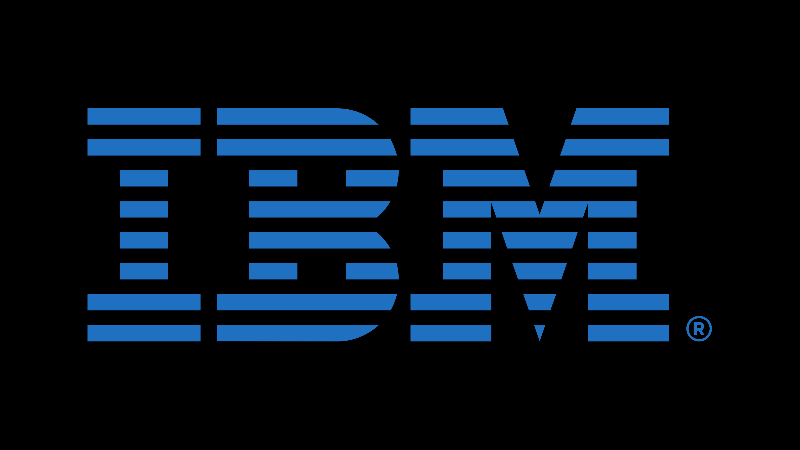
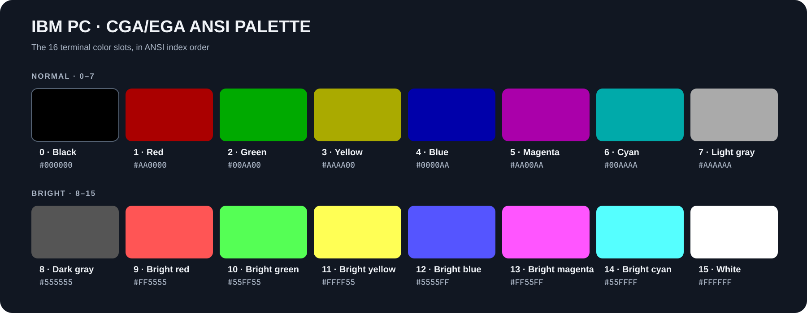
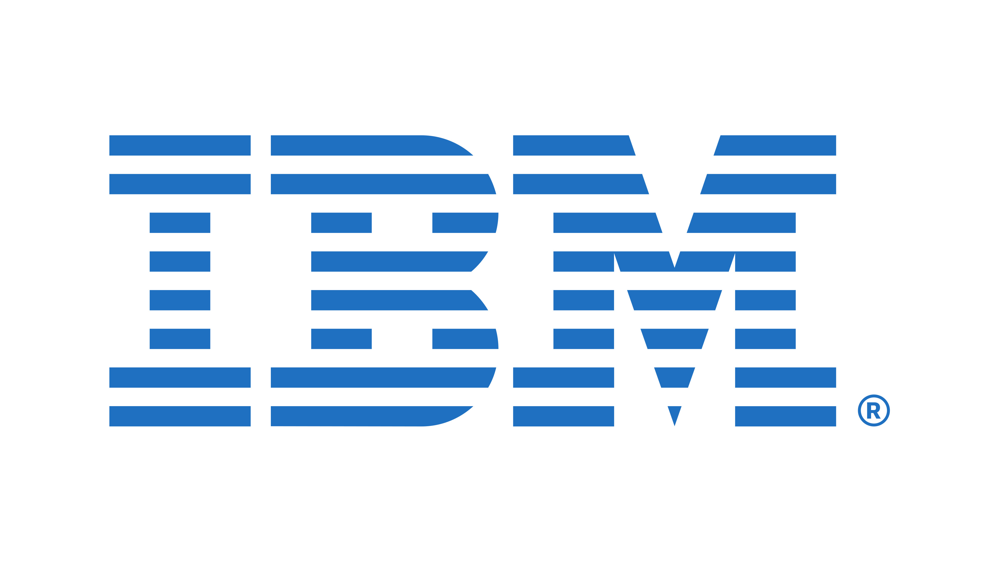
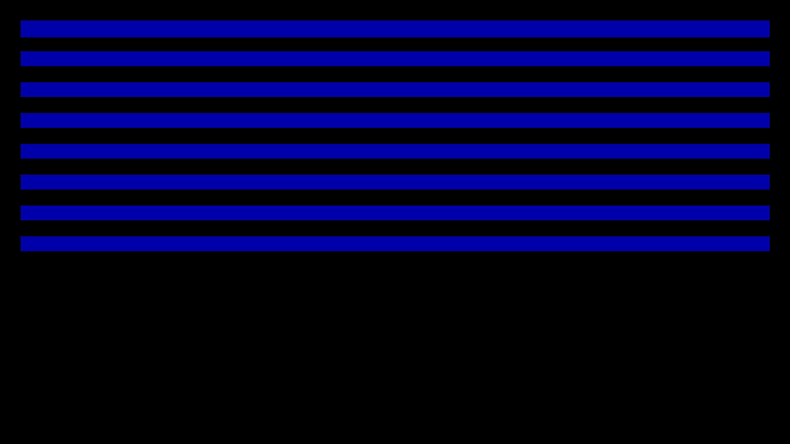
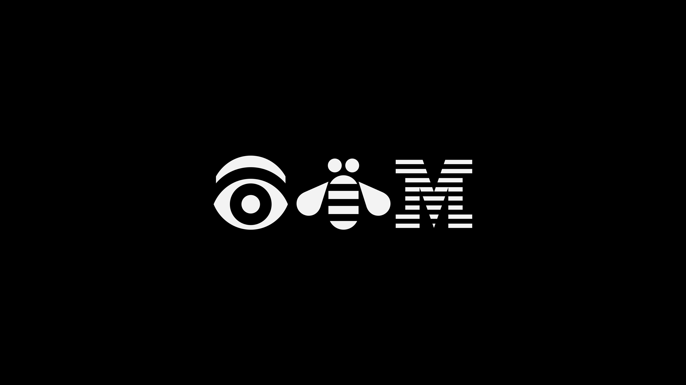
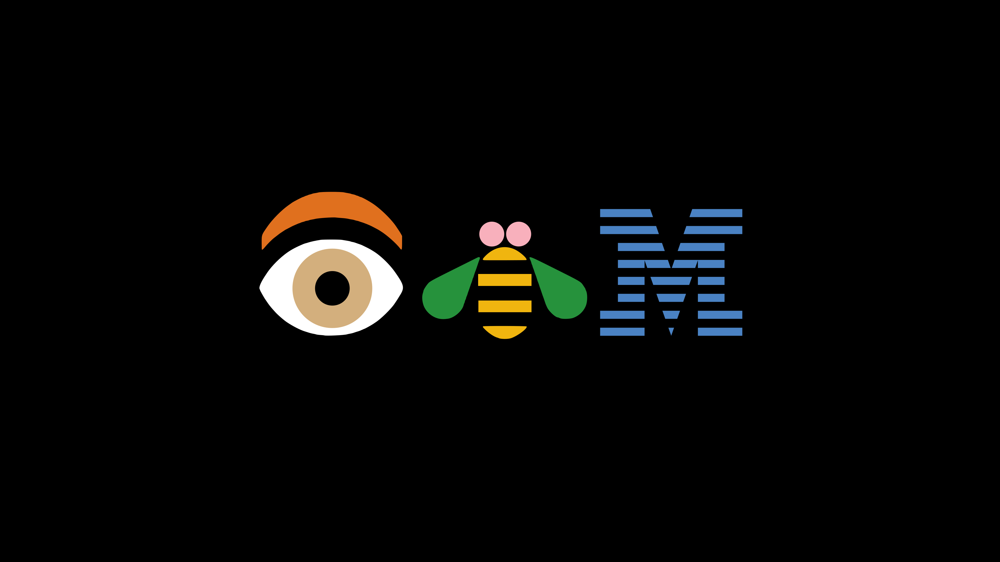

# IBM ANSI for Omarchy

**The IBM PC / PS/2 DOS color palette, brought to Omarchy.** Classic CGA/EGA ANSI colors, a pure-black desktop, and six IBM/Omarchy-inspired 4K wallpapers.

<p align="center">
  
</p>

## Install

```bash
omarchy theme install https://github.com/keylimesoda/omarchy-ibm-ansi
omarchy theme set omarchy-ibm-ansi
```

Cycle wallpapers with `omarchy theme bg next`. To select one by path, use `omarchy theme bg set <path-to-image>`.

## The 16 ANSI colors

The chart shows every terminal slot in index order: normal colors `0–7`, then bright colors `8–15`. Hex values are the colors in `colors.toml`.

<p align="center">
  
</p>

| Desktop key | Value |
| --- | --- |
| Background | `#000000` |
| Foreground | `#AAAAAA` |
| Accent | `#00AA00` |

## Wallpaper gallery

All six wallpapers are **3840 × 2160**. Click any image to open the full-resolution version.

<table>
  <tr>
    <td align="center"><a href="backgrounds/0-omarchy-wordmark.jpg"></a><br><b>Omarchy · theme gray</b></td>
    <td align="center"><a href="backgrounds/1-ibm-black.jpg"></a><br><b>IBM · black</b></td>
    <td align="center"><a href="backgrounds/2-ibm-white.jpg"></a><br><b>IBM · white</b></td>
  </tr>
  <tr>
    <td align="center"><a href="backgrounds/3-ibm-stripes.jpg"></a><br><b>Blue stripes</b></td>
    <td align="center"><a href="backgrounds/4-eye-bee-m-monochrome.jpg"></a><br><b>Eye-Bee-M · monochrome</b></td>
    <td align="center"><a href="backgrounds/5-eye-bee-m-color.png"></a><br><b>Eye-Bee-M · original color</b></td>
  </tr>
</table>

The color Eye-Bee-M wallpaper is rendered directly from [editable vector artwork](artwork/eye-bee-m-color.svg) to a lossless RGB PNG. See [reproduction and fidelity notes](artwork/README.md).

## Artwork credits

- The IBM 8-bar wordmark is from [Wikimedia Commons](https://commons.wikimedia.org/wiki/File:IBM_logo.svg).
- The monochrome Eye-Bee-M artwork is from [IBM Design Language](https://www.ibm.com/design/language/ibm-logos/rebus).
- The original-color Eye-Bee-M image is from [Wikimedia Commons](https://commons.wikimedia.org/wiki/File:Eye_Bee_M_Rebus_Logo.jpg), which credits Paul Rand and labels it public domain as a text logo. Commons also flags trademark restrictions.
- The Omarchy wordmark is from [bjarneo/100-themes](https://github.com/bjarneo/100-themes/blob/main/assets/omarchy-wordmark.svg).

IBM and Omarchy names and marks belong to their respective owners. This community theme is not affiliated with or endorsed by IBM or Omarchy; use of the marks may be subject to trademark restrictions.
