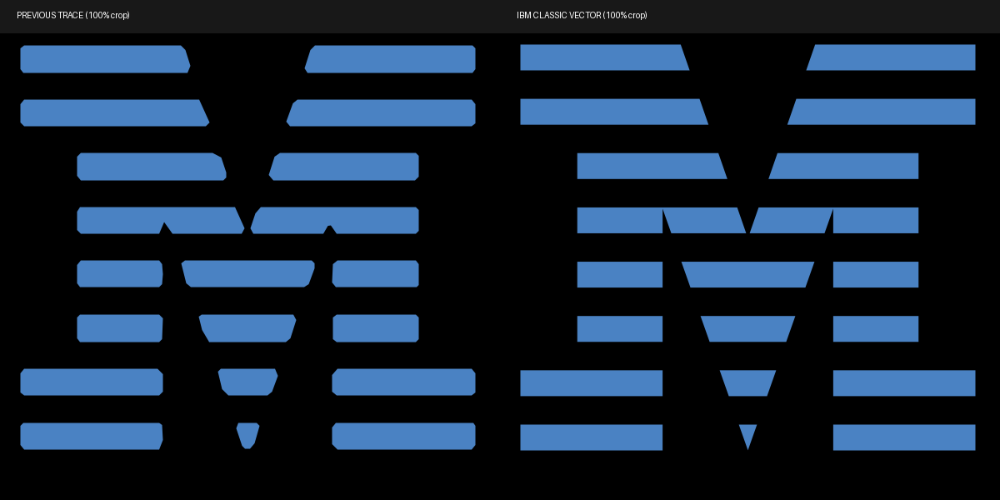

# Color Eye-Bee-M wallpaper

`eye-bee-m-color.svg` reconstructs the color artwork at its existing placement
on the 3840 × 2160 black canvas. The pupil, iris, and antenna dots use ellipse
primitives; the two rectangular bee stripes use rectangles; the eyebrow, eye,
wings, and bee caps use Bézier paths; the eight M stripes use polygons.
The SVG contains no embedded raster image, fonts, filters, or external assets.

## Source and fidelity

Reference: `backgrounds/5-eye-bee-m-color.jpg` at commit
`498477c15131a6a6518d4c2cca65854f533178a3`, originally enlarged from
[Wikimedia's 620 × 350 color image](https://commons.wikimedia.org/wiki/File:Eye_Bee_M_Rebus_Logo.jpg).
Original artwork: Paul Rand. The existing README's artwork credits apply.

The eye and bee are measured reconstructions, **not authenticated original
vector masters or a claim of pixel-perfect recovery**. The reference's antialiasing,
JPEG noise, and missing source detail make that impossible to establish.
IBM Design Language's current vectors have different contours and colors;
recoloring the monochrome wallpaper would therefore change this artwork.

Flat fills are per-channel medians of interior reference pixels, sampled after
8-pixel erosion to exclude edge blending:

| Element | RGB hex |
| --- | --- |
| Background and pupil | `#000000` |
| Eyebrow | `#E0701E` |
| Eye | `#FFFFFF` |
| Iris | `#D3AF7D` |
| Antenna dots | `#F8B0BC` |
| Bee stripes | `#F0B50F` |
| Wings | `#26923C` |
| M | `#4A82C3` |

Contours were located at 50% coverage along each fill's black-to-color ramp,
with the eye, bee, and M classified separately to exclude false-color JPEG
fringes. Isolated components smaller than 100 pixels were excluded. Ellipses
were fitted to measured contours, bee rectangles to component bounds, curved
paths with Potrace. The M is sourced directly from IBM’s classic rebus
vector, as described below.
These fits remove raster noise while introducing small contour differences.

Compared at 4K against those measured reference contours, symmetric boundary
distance is at most 2.83 pixels across the six eye and bee fills. The 95th-percentile
boundary distance is 1–2 pixels depending on the fill. These numbers describe
agreement with the blurred reference, not accuracy against a lost master.

## M geometry

The earlier raster trace softened and chamfered the stripe corners, including
small interior notches. The M now uses the **20 polygon point lists copied
verbatim** from IBM Design Language's [classic color rebus SVG](https://www.ibm.com/design/language/ab9936fcbc48b33beb969671629e07be/rebusclassic1.svg),
linked from the [official rebus page](https://www.ibm.com/design/language/ibm-logos/rebus/).
The classic and reversed monochrome SVGs were inspected at enlarged resolution;
both use straight sides and sharp outer corners, rather than rounded caps.
IBM also documents the distinction in bar thickness and counter shapes between
positive and reversed versions on its [8-bar page](https://www.ibm.com/design/language/ibm-logos/8-bar/).
The classic color rebus on black is the appropriate reference for this artwork.

Only a uniform scale and translation are applied: the M retains its previous
546-pixel width and center at (2577.5, 1047). Its height is now 487.057 pixels
instead of 485 pixels, preserving IBM's aspect ratio. The sampled blue fill
`#4A82C3` is retained. Its polygon coordinates, stripe proportions, diagonals,
sharp corners, and interior notches come from IBM, with no curve fitting,
smoothing, corner clipping, or independent stretching. Pixels outside the M
are identical to the previous PR render.

Source SVG SHA-256:

```
38c22f0264dcb89a449116d805e23d7faedb00a321030a5637a57a98b64ac846
```




## Re-render

Use a Python virtual environment with CairoSVG 2.9.1 and Pillow 12.3.0:

```sh
python tools/render-eye-bee-m.py
```

The script renders the vector directly at 3840 × 2160 and saves a lossless
8-bit RGB PNG, without JPEG artifacts or palette quantization. Antialiasing
occurs only during the final vector rasterization. Two repeated renders with
these versions produced the same SHA-256:

```
d79f71d4aefeee2e344afe1437696ba248ceb27069e7606ff23fa788ac1e3c93
```
