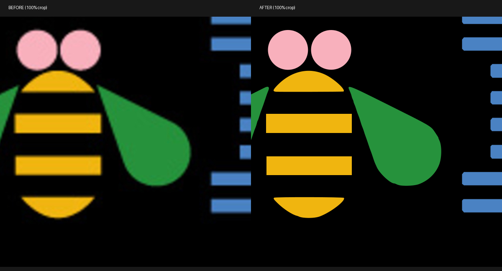

# Color Eye-Bee-M wallpaper

`eye-bee-m-color.svg` reconstructs the color artwork at its existing placement
on the 3840 × 2160 black canvas. The pupil, iris, and antenna dots use ellipse
primitives; the two rectangular bee stripes use rectangles; the eyebrow, eye,
wings, and bee caps use Bézier paths; the eight M stripes use polygons.
The SVG contains no embedded raster image, fonts, filters, or external assets.

## Source and fidelity

Reference: `backgrounds/5-eye-bee-m-color.jpg` at commit
`498477c15131a6a6518d4c2cca65854f533178a3`, originally enlarged from
[Wikimedia's 620 × 350 color image](https://commons.wikimedia.org/wiki/File:Eye_Bee_M_Rebus_Logo.jpg).
Original artwork: Paul Rand. The existing README's artwork credits apply.

This is a measured reconstruction, **not an authenticated original vector
master or a claim of pixel-perfect recovery**. The reference's antialiasing,
JPEG noise, and missing source detail make that impossible to establish.
IBM Design Language's current vectors have different contours and colors;
recoloring the monochrome wallpaper would therefore change this artwork.

Flat fills are per-channel medians of interior reference pixels, sampled after
8-pixel erosion to exclude edge blending:

| Element | RGB hex |
| --- | --- |
| Background and pupil | `#000000` |
| Eyebrow | `#E0701E` |
| Eye | `#FFFFFF` |
| Iris | `#D3AF7D` |
| Antenna dots | `#F8B0BC` |
| Bee stripes | `#F0B50F` |
| Wings | `#26923C` |
| M | `#4A82C3` |

Contours were located at 50% coverage along each fill's black-to-color ramp,
with the eye, bee, and M classified separately to exclude false-color JPEG
fringes. Isolated components smaller than 100 pixels were excluded. Ellipses
were fitted to measured contours, bee rectangles to component bounds, curved
paths with Potrace, and M polygons with a 2-pixel simplification tolerance.
These fits remove raster noise while introducing small contour differences.

Compared at 4K against those measured reference contours, symmetric boundary
distance is at most 2.83 pixels across all seven fills. The 95th-percentile
boundary distance is 1–2 pixels depending on the fill. These numbers describe
agreement with the blurred reference, not accuracy against a lost master.



## Re-render

Use a Python virtual environment with CairoSVG 2.9.1 and Pillow 12.3.0:

```sh
python tools/render-eye-bee-m.py
```

The script renders the vector directly at 3840 × 2160 and saves a lossless
8-bit RGB PNG, without JPEG artifacts or palette quantization. Antialiasing
occurs only during the final vector rasterization. Two repeated renders with
these versions produced the same SHA-256:

```
4e14d1fe88409fa126b7065bbd24d83ef2c3b3b69a878350869ca20809d0a2c6
```
